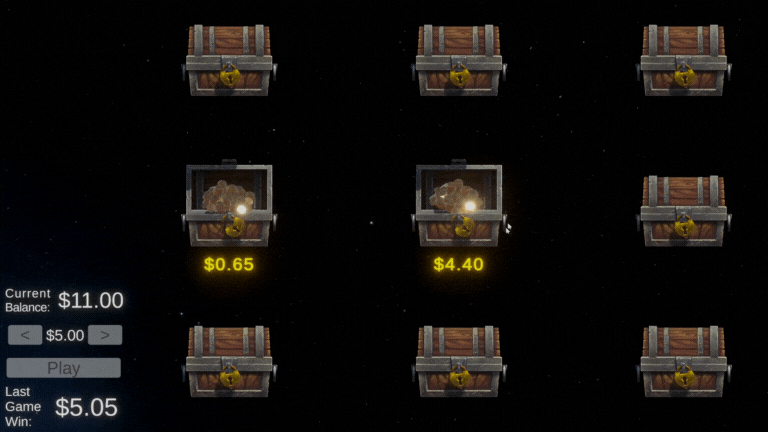

# Make a Bet!
This is a small project designed to prototype a betting inteface that could be used as a in a game that impements gambling mechanics. The coin and chest models were free assets from the Unity asset store. All shaders (e.g., the coin drop and black hole shader) were made by me using shadergraph. Animations were made by me using either Unity's built-in animator or coroutines. 

##  Select a chest to reveal the prize!

Win probabilities are based on weighted random sets and winnings are sorted separated into a random number of chests with a minimum increment of $0.05. Winnings are sorted in ascending order. Unit tests are used to confirm probabilities and winnings using Unity's test framework.

## Selecting a Black Hole ends the round

